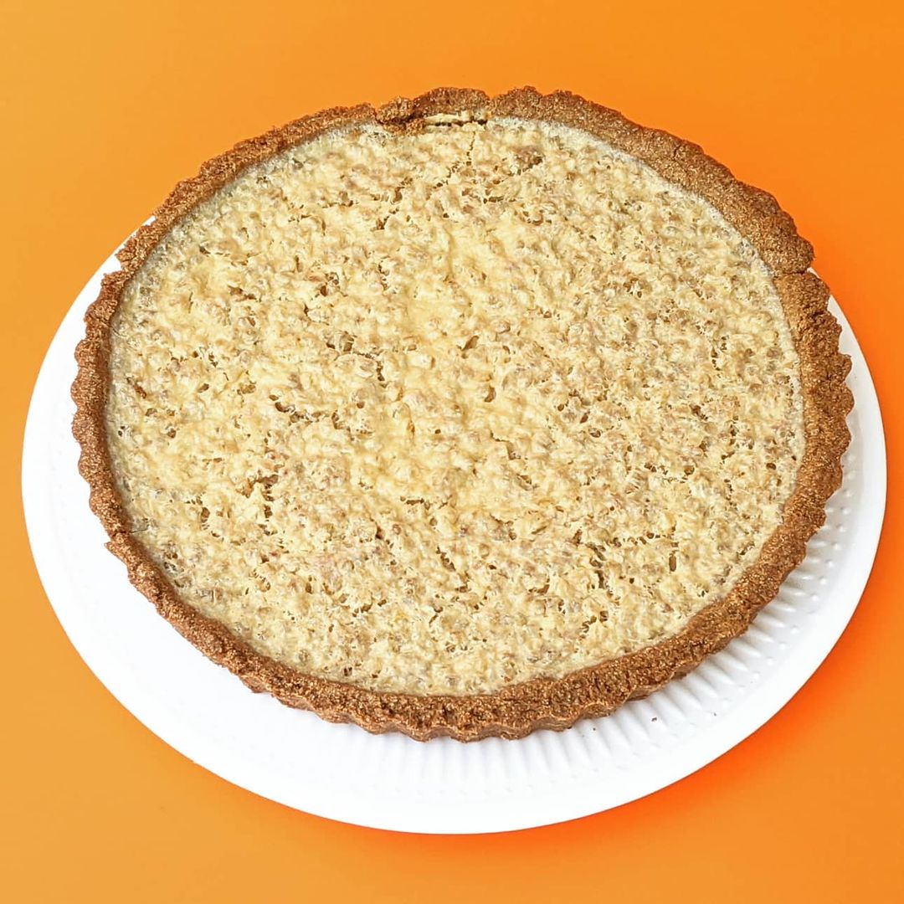
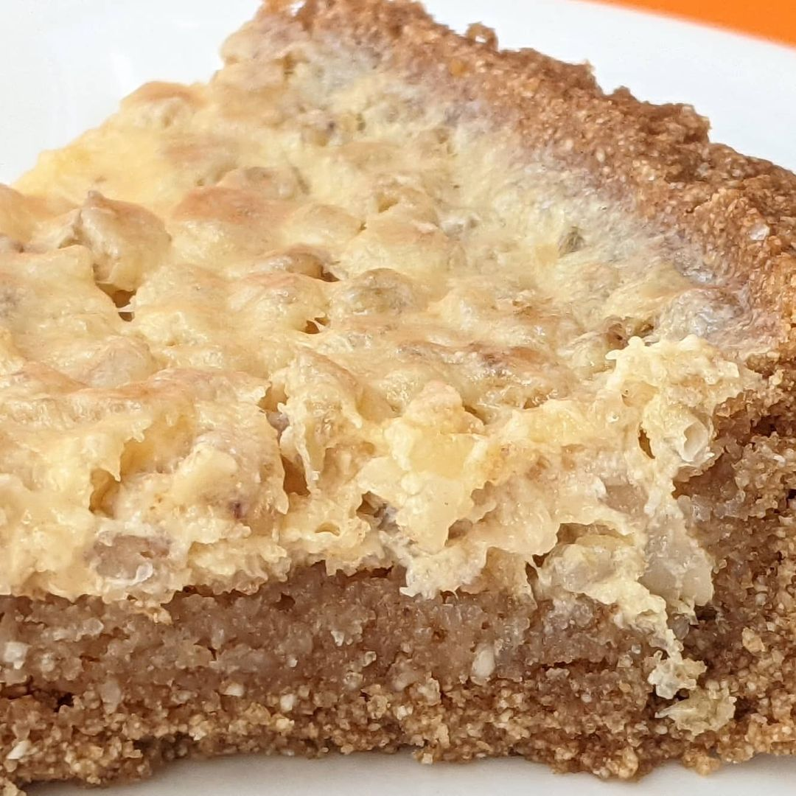

# Buckwheat Tart Project
> ## Buckwheat Tart with coconut and green buckwheat creme

1. Crust:
    - Ingredients:
      - buckwheat flour: 240g
      - butter cold: 120g
      - sugar brown: 100g
      - cinnamon ground: 1/4 tsp
      - lemon oil/extract: 5 drops
      - egg large: 1
    - Steps:
      - put flour, butter, sugar, cinnamon, lemon oil
        in food proccessor and cut untill wet sand texture
      - add an egg
      - put into fridge for an hour
    - Baking:
      - form: tart pan 24cm (removable)
      - temp: 175c
      - time: 16m

2. Creme:
    - Ingredients:
      - coconut condensed milk: 120g
      - buckwheat green coocked: 120g
      - honey: 55g
      - lemon juice: 20g
      - water: 50g
      - egg yolks large: 2
      - lemon oil/extract: 3 drops
      - citrus oil/extract: 3 drops
    - Steps:
      - mix everything together and pour into tart pan
    - Baking:
      - temp: 150c
      - time: 25m

3. Tasting:
    - Crust:
      - texture: 
          the doe is very crumbly 
          it is very dry and sandy, and the buckwheat leaves miniature grains
      - taste:
          strong buckwheat taste with notes of cinnamon
    - Creme:
      - texture:
          the whole buckwheat grains are prominent with creme inbetween
      - taste:
          very lemony and buckwheat

4. Projection:
    - Moisture:
        the buckwheat absorbs a lot of th water content
        should add moisture (especially in the crust)
    - Elasticity:
        should add some binding agent (gluten, egg) or alike into crust
    - Creme:
        the whole buckweat texture is disturbing to some people
        should try brown buckwheat for the creme next time
        can add more fat (milk butter)

        