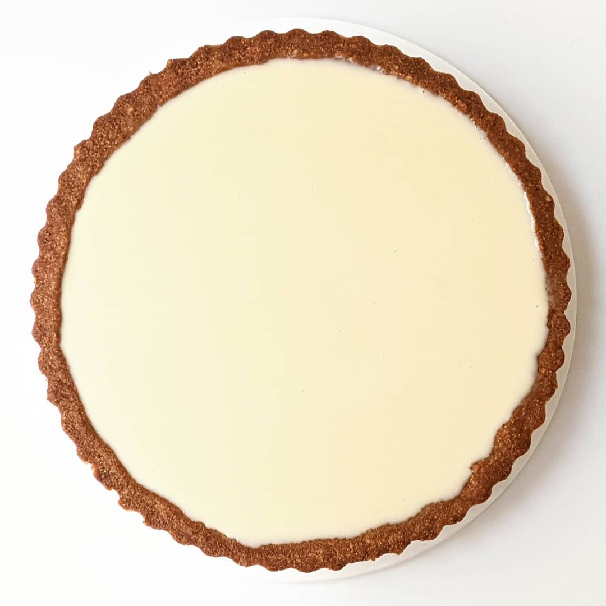
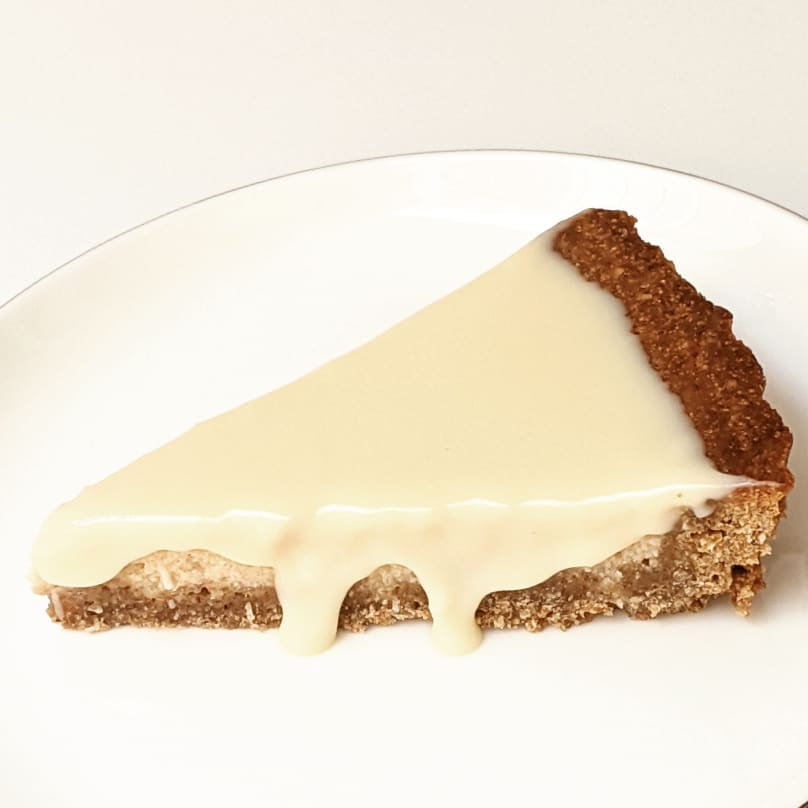

# Buckwheat Tart Project
> ## Buckwheat Tart with coconut and green buckwheat creme

1. Crust:
    - Ingredients:
      - buckwheat flour: 93g
      - almond flour: 47g
      - oatmeal: 50g
      - ground coconut: 50g
      - coconut oil: 100g
      - sugar brown: 100g
      - cinnamon ground: 1/4 tsp
      - flax seeds: 2tsp
      - chia seeds: 2tsp
      - cornflour: 2tblsp
      - water: 100ml
    - Steps:
      - grind flax and chia seed with cornflour add water to thicken
      - cut buckwheat almond oatmeal coconut sugar cinnamon together in food proccessor
      - add coconut oil
      - add seed water mixture 
    - Baking:
      - form: tart pan 24cm (removable)
      - temp: 175c
      - time: 17m

2. Creme:
    - Ingredients:
      - coconut condensed milk: 120g
      - buckwheat green coocked: 120g
      - honey: 35g
      - lemon juice: 75g
      - eggs: 2 large
      - lemon oil/extract: 5 drops
    - Steps:
      - cut everything together in food proccessor 
    - Baking:
      - temp: 175c
      - time: 28m

3. Tasting:
    - Crust:
      - texture: 
      - taste:
    - Creme:
      - texture:
      - taste:

4. Projection:
    - Moisture:
    - Elasticity:
    - Creme:

        